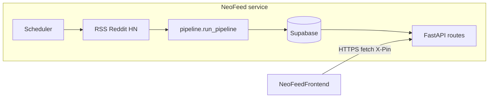

# NeoFeed

AI & Crypto News Aggregator with Trust Verification.

Scrapes news from RSS feeds, Reddit, Hacker News, and Twitter-style bridges; runs a verification pipeline (clustering → heuristics → optional Gemini); stores data in Supabase; serves a REST API consumed by [**NeoFeedFrontend**](https://github.com/Mukulbanjade/NeoFeedFrontend) on Vercel, plus optional Discord/Telegram/email digests.

## Pipeline overview



1. **`scrape_and_process`** ([`scheduler/jobs.py`](scheduler/jobs.py)) runs on an interval + once at startup ([`main.py`](main.py)).
2. Scrapers produce **raw articles**.
3. **`run_pipeline`** ([`verification/pipeline.py`](verification/pipeline.py)) clusters and scores articles, persists **articles/clusters**.
4. **FastAPI** exposes **`/clusters`**, **`/articles`**, **`/auth/verify`**, etc. Protected routes expect **`X-Pin`** when `PIN_HASH` is configured ([`api/middleware.py`](api/middleware.py)).
5. **`GET /health`** includes **scrape metadata** (`last_scrape_success`, `last_scrape_error`) — scrape failures explain **missing fresh data**, not necessarily “API down”.

## Failure map (what to verify)

| Symptom | Check |
|---------|--------|
| UI shows **Failed to fetch** | Browser cannot complete HTTP — wrong API URL (`https`), blockers, TLS. Not the same as “Invalid PIN”. |
| **Invalid PIN** / **PIN required** | Render **`PIN_HASH`** must match bcrypt (or plaintext fallback) for the PIN you type. |
| **Empty clusters** though API works | Scraping failures in `/health` or filters; clusters still served from DB if present |
| Frontend never updates | Backend OK but **Vercel deploy failed** (see frontend repo README) |

## Quick Start

```bash
cd NeoFeed
python -m venv venv
source venv/bin/activate
pip install -r requirements.txt

cp .env.example .env
# Edit .env — see Required Keys below

python -c "import bcrypt; print(bcrypt.hashpw(b'YOUR_NUMERIC_PIN', bcrypt.gensalt()).decode())"
# Put output in PIN_HASH in .env (Render: Environment → PIN_HASH)

# Run database/schema.sql in Supabase SQL editor

uvicorn main:app --reload --port 8000
```

### Render checklist (authentication)

1. **`PIN_HASH`** contains a **full bcrypt `$2b$...` hash** generated for your chosen PIN — not the naked digits unless you intentionally use plaintext fallback (`_check_pin` in [`api/middleware.py`](api/middleware.py)).
2. After changing `PIN_HASH`, **redeploy** the service.
3. Test: `curl -s -X POST https://<your-host>/auth/verify -H "Content-Type: application/json" -d '{"pin":"YOUR_PIN"}'`

### Operational checks

- **`GET /health`** — service up + last scrape/error fields ([`scheduler/jobs.py`](scheduler/jobs.py) exposes state via [`get_scrape_status`](scheduler/jobs.py)).
- **CORS:** [`config.py`](config.py) `cors_origins` defaults to `*` (with `credentials=False`) so SPA + `X-Pin` works from Vercel or custom domains.

## Setup — required keys

| Key | Where to get it |
|---|---|
| `SUPABASE_URL` / `SUPABASE_SERVICE_ROLE_KEY` | Supabase Dashboard → Settings → API |
| `GEMINI_API_KEY` | [Google AI Studio](https://aistudio.google.com) |
| `REDDIT_CLIENT_ID` / `REDDIT_CLIENT_SECRET` | [reddit.com/prefs/apps](https://reddit.com/prefs/apps) |
| Discord / Telegram / Resend keys | Provider dashboards |

## API endpoints

| Method | Endpoint | Notes |
|---|---|---|
| `GET` | `/` | Public status |
| `GET` | `/health` | Public; includes scrape timestamps/errors |
| `POST` | `/auth/verify` | Body `{ "pin": "..." }` — verify before SPA stores PIN |
| `POST` | `/auth/setup` | Returns bcrypt hash guidance |
| `GET` | `/clusters/` | Protected: `X-Pin` |
| `GET` | `/clusters/summary` | Protected: `X-Pin` |
| `POST` | `/admin/scrape` | Manual scrape |
| `GET` | `/admin/scrape-status` | Metadata |
| `POST` | `/admin/digest` | Manual digest |

Articles, votes, preferences routes are protected similarly — see [`api/routes/`](api/routes/).

## Deployment

- Backend: **[Render](https://render.com)** using [`render.yaml`](render.yaml) (Python).
- Frontend: **[Vercel — NeoFeedFrontend](https://github.com/Mukulbanjade/NeoFeedFrontend)**.

### Cold start / scraping on free tier

1. Cron `POST .../admin/scrape` with `X-Pin` every ~10–15 minutes (wake + ingest).
2. **`GET /health`** is public (`last_scrape_completed_at`, `last_scrape_error`). **`GET /admin/scrape-status`** requires `X-Pin` — use it only from trusted jobs with PIN.

Suggested env:

- `SCRAPE_INTERVAL_MINUTES=15`
- `CORS_ORIGINS=*` — or comma-separated frontend origins
